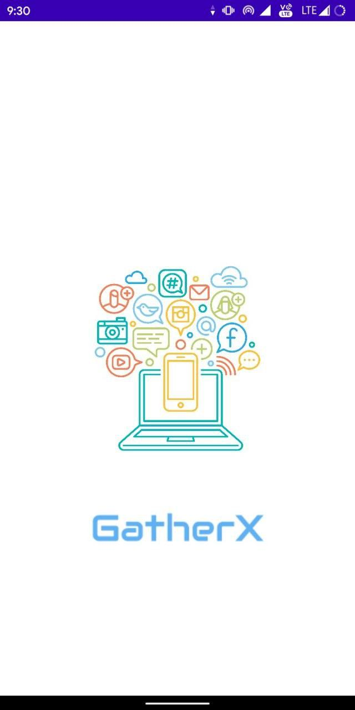
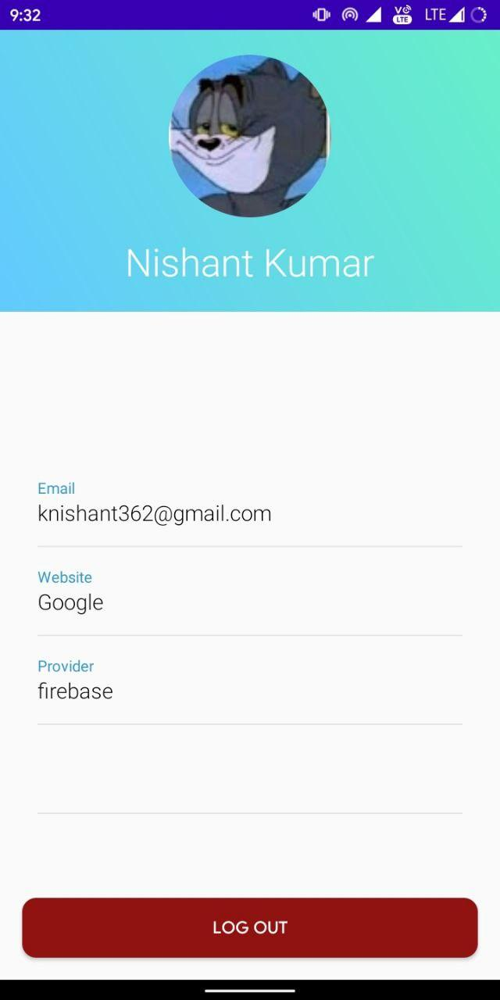

## GatherX
Social Media Connector 
This App is made to complete Task #5 of Graduate Rotational Internship Program(GRIP) of The Sparks Foundation i.e Social Media Integration in an Android App

In this App, User can login by Social Media like Facebook and Twitter, Then his/her basic info like Name, Profile photo and Email are displayed on the second page.

# Preview

